# QA Engineer Skill

[](https://github.com/Vann4799/qa-engineer/actions/workflows/ci.yml)
[](https://github.com/Vann4799/qa-engineer/releases)
[](package.json)
[](LICENSE)

Turn a coding agent into a QA engineer that runs the whole test lifecycle, not a
description of one. It plans the tests, writes the artifacts, executes them (by
hand through the browser console, or automated with Playwright), proves every
result with data, files what breaks, and hands it all back through Git, CI and
Jira. Works with Claude Code, Codex, OpenCode, Hermes Agent, and Qoder CLI.

The counterweight to "looks fine to me": every claim carries evidence, an HTTP
status, a JSON return, a SQL row count, an exit code. Live console QA takes no
screenshots by default and drives the page through `evaluate_script`, so a full
pass costs a handful of small JSON returns instead of a wall of pixels.

## Demo



A scripted playback of one real pass: install the skill, then a console QA run on
a login flow that verifies the session, asserts the DOM, and ends in a SHIP
verdict plus a CSV export. It is an animated SVG, so it plays in the browser and
on GitHub with no dependencies. Want a true video capture instead? Run the
Playwright recipe in `references/automation-playwright.md` with
`use: { video: 'on' }` against your own app.

## What it covers

| Phase | What the agent does | Backed by |
|-------|--------------------|-----------|
| Plan | test plan, scope, risk-based priority, entry/exit criteria | `assets/test-plan-template.md` |
| Write | test cases (happy, negative, boundary, permission) + bug reports | `assets/test-case-template.md`, `assets/bug-report-template.md` |
| Execute, manual | live UI QA from the browser console, no screenshots | `references/console-qa.md`, `references/console-snippets.md` |
| Execute, API | status codes, schema, auth, validation, idempotency | `references/api-testing.md` |
| Verify data | confirm writes/cascade/cleanup in MySQL or PostgreSQL | `references/database-testing.md` |
| Report | reproducible bug reports with severity vs priority | `references/testing-fundamentals.md` |
| Automate | Playwright + TypeScript suite, POM, CI-safe specs | `scripts/scaffold_playwright.mjs`, `assets/playwright-spec.template.ts` |
| CI | wire the suite into GitHub Actions | `assets/qa-ci.yml`, `references/cicd-github-actions.md` |
| Ticket | file and triage in Jira | `references/tools-jira-devtools.md` |
| Hand off | export the QA docs to Excel or Google Sheets | `scripts/export_qa.mjs`, `references/spreadsheet-export.md` |

Most real jobs combine phases: write the case, execute it in the console, confirm
in the database, file the bug, automate the regression, then CI.

## Runs on any agent

The skill maps capabilities to whatever tool the host exposes, so it degrades
gracefully instead of breaking:

- File + shell (read, write, `node`, `git`, `curl`) covers about 90% of the
  lifecycle on Claude Code, Codex, OpenCode, Hermes and Qoder alike.
- Only Phase 3 (live console QA) needs a browser tool of the `evaluate_script`
  kind. No browser? The agent says so and falls back to API, database and
  automation checks rather than inventing a result.

All bundled scripts are dependency-free Node 18 or newer. On Windows use `pnpm`,
not `npm`.

## Install

### One command

```bash
npx github:Vann4799/qa-engineer --list   # see what it would touch
npx github:Vann4799/qa-engineer          # install into detected agents
```

It copies `skills/qa-engineer/` into each agent skills folder it finds
(`~/.claude/skills`, `~/.codex/skills`, `~/.agents/skills`), refuses to overwrite
without `--force`, and prints the `hermes skills add` command instead of guessing
at Hermes. `--host claude,qoder` or `--dir <path>` narrow it down. No network, no
dependencies.

### Claude Code plugin

```
/plugin marketplace add Vann4799/qa-engineer
/plugin install qa-engineer@vann4799-qa
```

### By hand

```bash
git clone https://github.com/Vann4799/qa-engineer.git /tmp/qaengineer
```

Then copy `skills/qa-engineer/` into whichever skills directory your agent reads
(`~` is `%USERPROFILE%` on Windows):

```bash
cp -r /tmp/qaengineer/skills/qa-engineer ~/.claude/skills/    # Claude Code
cp -r /tmp/qaengineer/skills/qa-engineer ~/.codex/skills/     # Codex / OpenCode
cp -r /tmp/qaengineer/skills/qa-engineer ~/.agents/skills/    # Qoder CLI
hermes skills add /tmp/qaengineer/skills/qa-engineer          # Hermes Agent
```

Restart the session (or reload skills) so the new skill is discovered.

## Use

```
Bikin test case buat flow login
QA lewat console, hemat token, tanpa screenshot
Test API checkout-nya, cek sekalian ke database
Lapor bug: total checkout jadi NaN
Automation Playwright buat regression + pasang CI
Export dokumentasi QA ke Excel / Google Sheet
```

The agent registers the ten lifecycle phases as tracked tasks, loads only the
reference each phase needs, executes with evidence, and validates every artifact
before calling it done.

## Layout

```
.
├── cli/index.mjs                      npx installer: detect hosts, copy the skill
├── demo/terminal.svg                  animated playback of one QA pass
├── tests/run.mjs                      dependency-free suite: validator, exporter, scaffolder, shape, installer
├── tests/fixtures/{good,bad}/         passing artifacts and one that must fail
├── .claude-plugin/                    plugin.json + marketplace.json
├── .github/workflows/ci.yml           the suite on Node 18 / 20 / 22
└── skills/qa-engineer/
    ├── SKILL.md                       orchestrator: ground rules, host mapping, 10-phase lifecycle
    ├── references/
    │   ├── testing-fundamentals.md    scenarios, cases, bug reports, severity/priority, regression/smoke/exploratory
    │   ├── console-qa.md              the manual console QA playbook (session, smoke, interactions)
    │   ├── console-snippets.md        copy-paste evaluate_script bodies
    │   ├── api-testing.md             endpoint testing, Postman/Newman, assertions
    │   ├── database-testing.md        MySQL/Postgres QA query patterns
    │   ├── automation-playwright.md   Playwright + TypeScript patterns, POM, CI-safe specs
    │   ├── git-github.md              branch/commit/PR workflow for test code
    │   ├── cicd-github-actions.md     GitHub Actions test workflow
    │   ├── tools-jira-devtools.md     Jira ticket flow + DevTools usage
    │   └── spreadsheet-export.md      QA docs to Excel / Google Sheets (CSV, Sheets API, .xlsx)
    ├── assets/
    │   ├── test-plan-template.md      fill-in test plan
    │   ├── test-case-template.md      fill-in test case
    │   ├── bug-report-template.md     fill-in bug report
    │   ├── playwright-spec.template.ts  starter POM + tagged spec
    │   └── qa-ci.yml                  GitHub Actions workflow template
    └── scripts/
        ├── validate_artifacts.mjs     deterministic completeness check, exit 1 on any FAIL
        ├── export_qa.mjs              QA markdown to CSV tables for Excel / Google Sheets
        └── scaffold_playwright.mjs    generate a Playwright + TypeScript project skeleton
```

`references/` is loaded only for the phase that needs it, so the whole library
never sits in the context window at once.

## Scripts

All three are dependency-free Node (18 or newer) and run on any machine.

```bash
node scripts/validate_artifacts.mjs test-case.md bug-report.md
node scripts/export_qa.mjs qa-docs.md --out ./qa-export
node scripts/scaffold_playwright.mjs ./e2e
```

- **`validate_artifacts.mjs`** detects the artifact type per file (test case, bug
  report or test plan, override with `--type`), then checks required fields,
  numbered steps, severity/priority vocabularies, leftover `[placeholders]` and
  `TODO:` notes, and thin evidence. It exits non-zero on any `FAIL`, so it drops
  into CI or a pre-commit hook.
- **`export_qa.mjs`** turns QA markdown into spreadsheet tables: a UTF-8-BOM CSV
  per artifact kind (test cases, bugs, traceability, summary counts) that opens
  in Excel and imports into Google Sheets. For a live Sheet or a multi-tab
  `.xlsx`, see `references/spreadsheet-export.md`.
- **`scaffold_playwright.mjs`** writes a Playwright + TypeScript skeleton with
  `webServer` auto-start, a Page Object and a tagged sample spec, and refuses to
  clobber an existing project without `--force`.

## Tests and CI

```bash
node tests/run.mjs      # no dependencies, exit 0 = green
```

The suite is why the README can say "deterministic" out loud. It asserts the good
test case, bug report and test plan each pass with zero warnings and are detected
as the right type; that the broken bug report exits 1 and names every fault
(placeholder, TODO, bad severity/priority, missing Actual and Evidence); that the
exporter writes all four CSVs with a BOM and the parsed values intact; that the
scaffolder writes the project and refuses to clobber; that the skill keeps its own
conventions (frontmatter, description length, under 500 lines, no README inside
the skill folder, every reference/asset/script linked from `SKILL.md`); and that
the installer copies, refuses to overwrite, and leaves a working validator behind.
CI runs it on Node 18, 20 and 22.

## Ground rules the skill enforces

- **Only apps you own:** local, staging, preview. Never third-party sites.
- **Reads anywhere you own; writes on staging/local only,** never production.
- **Credentials** are asked once per session or read from an env var you name.
  Never scraped from repo files, never written into a report or a saved snippet.
- **Stop and say so** when a phase cannot run (app down, login rejected, no DB or
  browser access). A QA report built on a broken premise is worse than none.

## Customising

Edit the files rather than the workflow:

- `references/*.md`: the playbooks and query patterns your team actually uses
- `assets/*-template.md`: the artifact shapes; keep them in sync with the
  validator's required fields
- `scripts/validate_artifacts.mjs`: the `PRIORITIES`, `SEVERITIES` and
  `CASE_TYPES` vocabularies, or the required sections per artifact type
- `assets/qa-ci.yml`: smoke-on-PR vs regression-on-push, browser cache, artifacts
- `cli/index.mjs` (the `HOSTS` table): another agent's skills directory
- `demo/terminal.svg`: the playback lines and timings

## License

MIT
